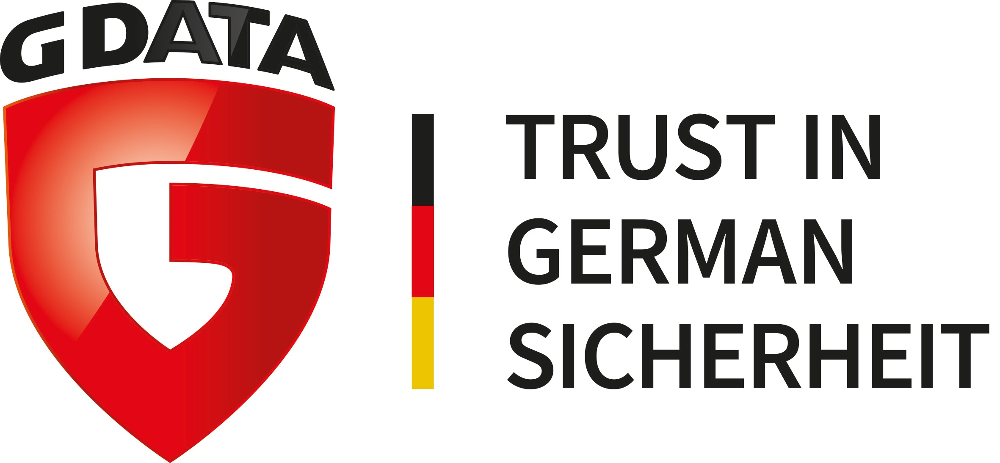
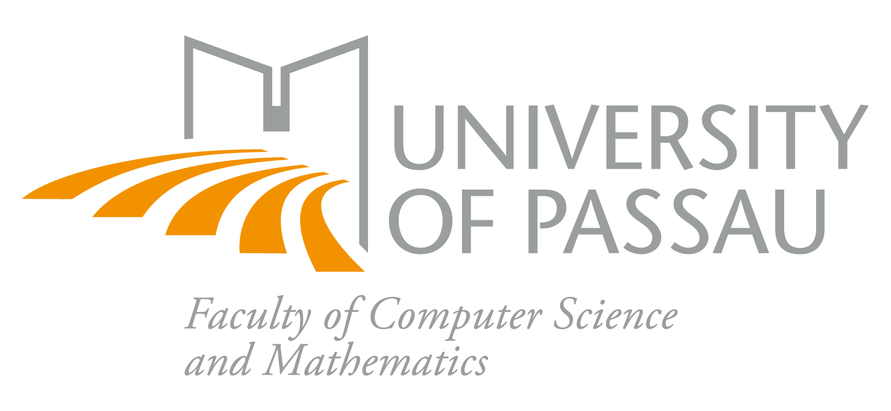

The project "Synthesizing ML training data in the IT security domain
for VMI-based attack detection and analysis" (SmartVMI) is a research project funded by the [BMBF](https://www.bmbf.de/) and [DLR](https://www.dlr.de/).

    BMBF support code: 01IS21063A-C
    Project Runtime: 01.10.2021 - 30.09.2023

The consortium working on the project consists of three entities. The [G DATA CyberDefense AG](https://www.gdata.de/), [Innowerk-IT GmbH](https://www.innowerk-it.de/) and [University of Passau](https://www.fim.uni-passau.de).

___

## Attack pattern generation for trace detection

### Motivation
Just a few years ago, IT systems were primarily isolated and operated within easily protected boundaries. These systems could only communicate within a single company or within a fixed organizational context. Attacks were therefore usually limited in their impact. However, this situation has changed significantly. Today's IT systems are more like fragile entities. They use diverse, flexible, virtualized and highly networked applications, which are often operated outside the company or organizational structures. Complex attacks specifically tailored to a company or organization have been on the rise in the recent past. These attacks drastically illustrate the vulnerability and abuse potential of IT systems.

### Goals and approach
The SmartVMI project is dedicated to improving artificial intelligence (AI)-based attack detection, enabling attack defense and attack analysis, and supporting digital forensics by generating tailored synthetic attack patterns. This will enable the simulation of novel attack scenarios and the testing of existing attack detection and analysis mechanisms as well as the optimization of these mechanisms for new attacks. All tools developed in the course of the SmartVMI project will be made available in the open source model and validated training data obtained will be published in the public data set model. A university and two companies are working closely together in the consortium.

### Innovations and perspectives
The novelty of the project lies in the development of methods for generating customized synthetic training data for machine-based learning. This means that data does not have to be collected laboriously and possibly with a time delay, but can be generated promptly (if necessary also preventively) and in a targeted manner. The major benefit is the faster adaptation of attack detection mechanisms to new attacks as well as to new software systems. 

The tools as well as the generated and validated training data will be released to the public so that third parties can adapt them to their own mechanisms and infrastructures. Small and medium-sized enterprises in particular are expected to benefit from this offering. They should use the resulting data generation algorithms as an open source solution and use this reference implementation as a starting point for their own product developments and services.

In the German economy alone, computer crime causes damage of more than 10 billion euros every year. Securing IT systems against cyber attacks and cyber espionage is therefore crucial for the economy and society to be able to take advantage of the progress and opportunities offered by digitization. In the funded project, procedures are being researched that, on the one hand, use innovative forensic reconnaissance methods to investigate and understand attack scenarios. On the other hand, these findings will be used to create new possibilities for detecting and preventing such attacks in advance and in real time.

### Accepted Publications

* Sentanoe, S., Dangl, T. and Reiser, H.P., 2022. KVMIveggur: Flexible, secure, and efficient support for self-service virtual machine introspection. Forensic Science International: Digital Investigation
* Dangl, T., Sentanoe, S. and Reiser, H.P., 2022, August. VMIFresh: Efficient and Fresh Caches for Virtual Machine Introspection. In The 17th International Conference on Availability, Reliability and Security
* Sentanoe, S., Fellicious, C., Reiser, H.P. and Granitzer, M., 2022, December. “The Need for Speed”: Extracting Session Keys From the Main Memory Using Brute-force and Machine Learning. In 2022 IEEE International Conference on Trust, Security and Privacy in Computing and Communications (TrustCom) (pp. 1028-1035). IEEE.
* Fellicious, C., Wendlinger, L. and Granitzer, M., 2023, March. Neural Network Based Drift Detection. In Machine Learning, Optimization, and Data Science: 8th International Workshop, LOD 2022, Certosa di Pontignano, Italy, September 19–22, 2022, Revised Selected Papers, Part I (pp. 370-383). Cham: Springer Nature Switzerland.

### Accepted Poster

* Sentanoe, S., Reiser, H.P., Fellicious, C., Granitzer, M., Dangl, T., Beierl, N., Hausotte, S., Bischof, M., Eikenberg, D., Mayer, K., Pavic, A. and Dambeck, S., 2022. SmartVMI: Reconstructing meaningful kernel-level and application-level information about a target system using machine learning. NordSec 2022, Iceland.

### Data Sets

* Fellicious, C., Sentanoe, S., Granitzer, M. and Reiser, H.P., 2022. Machine Learning Assisted SSH Keys Extraction From The Heap Dump (V0.1) [Data set]. Zenodo. https://doi.org/10.5281/zenodo.6537904
* Sentanoe, S., Fellicious, C., Reiser, H.P. and Michael, G., 2022. Extracting Session Keys From the Main Memory Using Brute-force and Machine Learning (V0.1) [Data set]. Zenodo. https://doi.org/10.5281/zenodo.7014775

___

With funding from the [BMBF](https://www.bmbf.de/) and organisational execution by the [DLR](https://www.dlr.de/).

