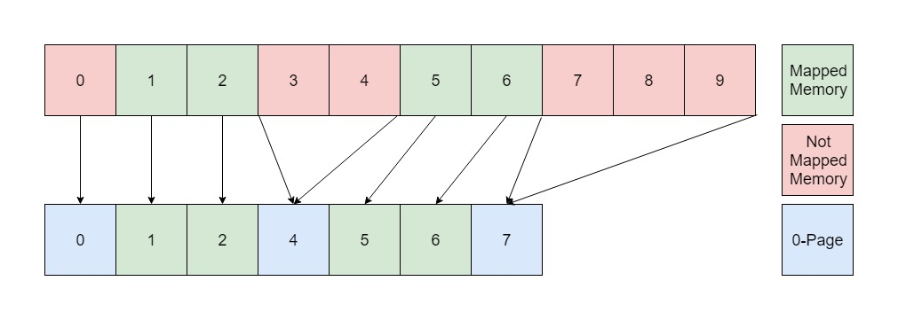

[](https://sonarcloud.io/summary/new_code?id=gdatasoftwareag_inmemory)
[](https://sonarcloud.io/summary/new_code?id=gdatasoftwareag_inmemory)

# InMemoryScanner Plugin

A plugin for _VMICore_ capable of scanning as well as dumping process memory from live VMs.\
The _InMemoryScanner_ scans each and every process that is terminated during runtime.
As soon as the shutdown of _VMICore_ is requested the _InMemoryScanner_ also scans all processes which are running at this point, except the ones excluded in the config.

## Memory Dumps

When memory dumping is activated the scanner dumps the scanned memory regions to a file. In addition to that a `MemoryRegionInformation.json` is created which contains extra information about all dumped regions.
Both dumping and scanning work on exactly the same data. What you see in the dumps is the same data the scanner operates on.

The content of the `MemoryRegionInformation.json` looks like the following:

```json
{
    "ProcessName": "abcdefghijklmnop",
    "ProcessId": 4,
    "SharedMemory": false,
    "AccessRights": "RWX",
    "StartAddress": "0x1234000",
    "EndAddress": "0x1234666",
    "BeingDeleted": false,
    "ProcessBaseImage": false,
    "Uid": 0,
    "DumpFileName": "abcdefghijklmn-4-RWX-0x1234000-0x1234666-0"
}
```

In order to simplify automated analysis of memory dumps each _json_ dictionary references the file containing the corresponding memory region in the `DumpFileName` key.
The dump filenames adhere to the following naming schema:

```console
{TruncatedProcessName}-{ProcessId}-{AccessRights}-{StartAddress}-{EndAddress}-{Uid}
```

The value of `ProcessName` is truncated to a maximum length of 14 characters and the `Uid` key is simply a counter starting at 0 and increasing by 1 for each scanned memory region.

The following values are valid:

| Element            | Value                                                                                                                                                                                                                                                                                                    |
| ------------------ | -------------------------------------------------------------------------------------------------------------------------------------------------------------------------------------------------------------------------------------------------------------------------------------------------------- |
| `SharedMemory`     | `false` for private memory, or `true` for example if file backed.                                                                                                                                                                                                                                        |
| `AccessRights`     | Any combination of `R` (read), `W` (write) / `WC` (copy on write), `X` (execute) as set within the VAD tree. It is noteworthy that _Windows_ sets these values only when a new memory region is created. **Therefore these extracted permissions do not necessarily reflect the state upon extraction.** |
| `BeingDeleted`     | `true`, `false`. If this flag is set to true the memory region was in the process of being deleted at the time of the scan, so its contents may be undefined.                                                                                                                                            |
| `ProcessBaseImage` | If this flag is set to true the memory region represents the base image of the running process.                                                                                                                                                                                                          |

## Technical Overview

The following sections give a detailed overview about how memory is retrieved.

### VAD Tree

Windows stores information regarding the memory state of each process in the VAD (Virtual Address Descriptor) tree.
For additional information see <https://www.codemachine.com/article_protopte.html> or the book "What makes it page" <http://www.opening-windows.com/wmip/overview.htm>.

### VAD Entry

Each VAD entry represents a coherent memory region.
The _InMemoryScanner_ extracts every region and scans it independently of other memory regions.
This means that _Yara_ rules which need to be applied to several memory regions at once can never match.
Within these memory regions not every page has to actually be present in memory. Therefore, non-mapped page ranges are substituted by
a single nulled page in order to avoid false positives during _Yara_ rule matching.

For example the following diagram shows the memory padding of one VAD region consisting of 10 pages where 6 are not mapped. These 6 pages are split over 3 not mapped subregions:


### Scanning Exceptions

Shared memory regions that are not the base image of the process are skipped by default in order to reduce scanning time.
This behavior can be controlled via the `scan_all_regions` config option.
To further optimize scan duration, memory regions >50MB will be ignored as well.
If desired, it is possible to increase or reduce the threshold via the `maximum_scan_size` config option.

### In Depth Example

Consider the following VAD entry from the vad tree of a process `winlogon.exe` with pid `488`:

| Element        | Value        |
| -------------- | ------------ |
| `ProcessName`  | winlogon.exe |
| `ProcessId`    | 488          |
| `MemoryType`   | private      |
| `AccessRights` | RW           |
| `BeingDeleted` | false        |
| `StartAddress` | 1f43b593000  |
| `EndAddress`   | 1f43b599000  |

This region has a size of `0x1f43b599000` - `0x1f43b593000` = `0x6000`.
However the pages from `0x1f43b596000` to `0x1f43b598000` (size `0x2000`) are not mapped into memory.
Therefore, the resulting files will have the size of `0x5000` (mapped size + one zero-page). Note that the start and end address however are the original ones.

```console
winlogon.exe-488-private-RW-1f43b593000-1f43b599000-BeingDeleted_FALSE
```

## How to Build

-   Install Build Requirements

    -   g++ or clang
    -   cmake
    -   libyara (with headers)

-   Clone this repository

-   **\[Optionally]** Create an output directory

-   Inside the output directory (or your current working directory for that matter), run:

```console
[user@localhost output_dir]$ cmake -D CMAKE_BUILD_TYPE=<Buildtype> -D PROGRAM_BUILD_NUMBER=<Buildnumber> <path_to_top_level_project_dir>
[user@localhost output_dir]$ cmake --build .
```

**Caveats**:

-   External headers will only be downloaded if they are missing, so a clean rebuild is advised
    if updates for those are available.

## How to Run

The _InMemoryScanner_ has to be used as a plugin in conjunction with the _VMICore_ project.
For this, add the following parts to the _VMICore_ config and tweak them to your requirements:

| Parameter           | Description                                                                                                                                                                |
| ------------------- | -------------------------------------------------------------------------------------------------------------------------------------------------------------------------- |
| `directory`         | Path to the folder where the compiled _VMICore_ plugins are located.                                                                                                       |
| `dump_memory`       | Boolean. If set to `true` will result in scanned memory being dumped to files. Regions will be dumped to an `inmemorydumps` subfolder in the output directory.             |
| `ignored_processes` | List with processes that will not be scanned (or dumped) during the final scan.                                                                                            |
| `maximum_scan_size` | Number of bytes for the size of the largest contiguous memory region that will still be scanned. Defaults to `52428800` (50MB).                                            |
| `output_path`       | Optional output path. If this is a relative path it is interpreted relatively to the _VMICore_ results directory.                                                          |
| `plugins`           | Add your plugin here by the exact name of your shared library (e.g. `libinmemoryscanner.so`). All plugin specific config keys should be added as sub-keys under this name. |
| `scan_all_regions`  | Optional boolean (defaults to `false`). Indicates whether to eagerly scan all memory regions as opposed to ignoring shared memory.                                         |
| `signature_file`    | Path to the compiled signatures with which to scan the memory regions.                                                                                                     |

Example configuration:

```yaml
---
plugin_system:
  directory: /usr/local/lib/
  plugins:
    libinmemoryscanner.so:
      signature_file: /usr/local/share/inmemsigs/sigs.sig
      dump_memory: false
      scan_all_regions: false
      maximum_scan_size: 52428800
      output_path: ""
      ignored_processes:
        - SearchUI.exe
        - system
```
